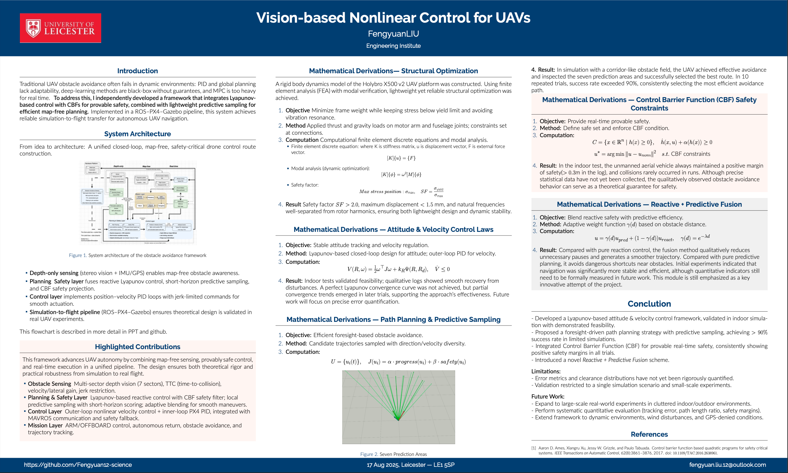
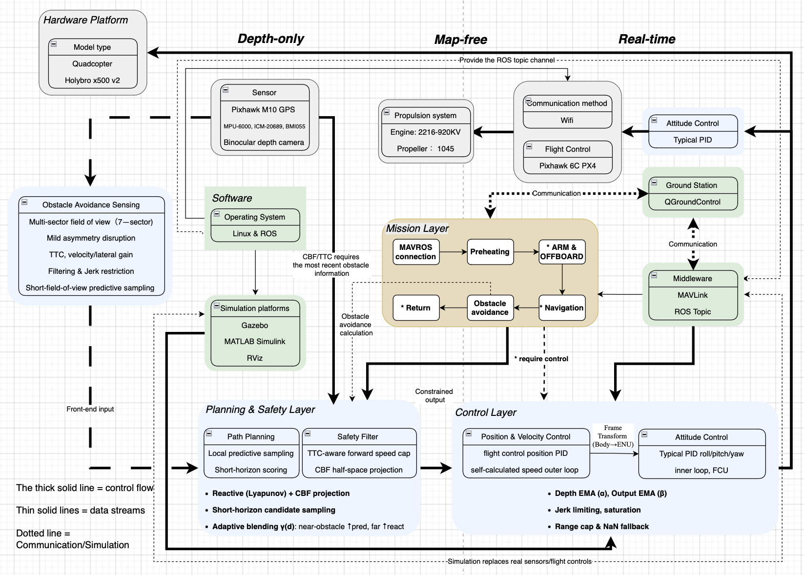

# Vision-based-Nonlinear-Control-for-UAVs
Vision-based Nonlinear UAV Control with Real-time Obstacle Avoidance using PX4, ROS, Lyapunov and Control Barrier Functions(CBF).

# Poster:

# Video:

# System Architecture:

This project has implemented an unmanned aerial vehicle (UAV) Control and obstacle avoidance system based on PX4 + ROS, integrating nonlinear Lyapunov control and Control Barrier Function (CBF), and supporting a smooth migration from simulation to the actual aircraft. The system operates in map-free, depth-only and real-time scenarios, and has robustness and real-time performance.

The system as a whole is divided into five major parts: perception layer → planning and safety layer → control layer → task layer → flight control/ground station. 
The data and control flow between the modules are as follows:
1. Hardware and sensor input

Sensors (GPS, IMU, binocular cameras) collect environmental and flight status information.
Data is input into the perception layer through ROS Topic.

2. Obstacle Avoidance Sensing

Perform multi-sector division and TTC (Time-to-Collision) calculation on the input depth map;
Perform filtering, jerk restriction and predictive sampling;
Output the status information of obstacles as the constraint conditions for the planning and safety layers.

3. Planning & Safety Layer

Path planning: Generate candidate trajectories by using local predictive sampling and short-time domain scoring;
Safety filtering: Combining CBF projection and TTC constraints to screen feasible trajectories;
Output restricted control instructions and pass them to the control layer.

4. Control Layer

Position and speed control: Outer loop PID + self-calculated speed control;
Attitude control: Inner loop PID (roll/pitch/yaw) maintains flight stability;
Provide limiting, filtering, and jerk restriction mechanisms to ensure the safety and executability of instructions;
Output control instructions to directly drive the flight control (Pixhawk PX4).

5. Mission Layer

Communicate with MAVROS and ground stations (QGroundControl);
Responsible for task-level logic (takeoff, landing, return, navigation, real-time obstacle avoidance);
Integrate the planning results with the flight control status to form a mission control closed loop.

Summary of the relationships between modules

Perception Layer → Planning and Safety Layer: Transmit obstacle information and predict environmental data;
Planning and Security Layer → Control Layer: Output control instructions under security constraints;
Control Layer → Task Layer: Provides posture/position feedback and supports logical execution of tasks;
Mission Layer ↔ Flight Control & Ground Station: Two-way communication ensures real-time mission execution and manual intervention.

# Installation
The following is a step-by-step guide for installing and building all prerequisites for running obstacle avoidance modules on Ubuntu 20.04 + ROS (including Gazebo 11) +PX4 and drones based on further reducing flight weight through structural optimization of Holybro X500 V2. If a part of your system has already been installed, you can skip the corresponding steps.

Note: The following description assumes
Your catkin workspace is at ~/catkin_ws
The PX4-Autopilot directory is at ~/Home
You can also make adjustments according to the actual situation.

