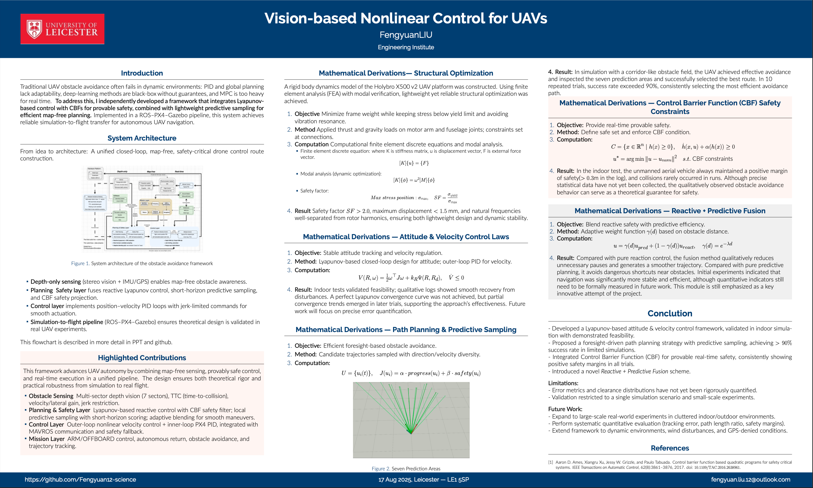
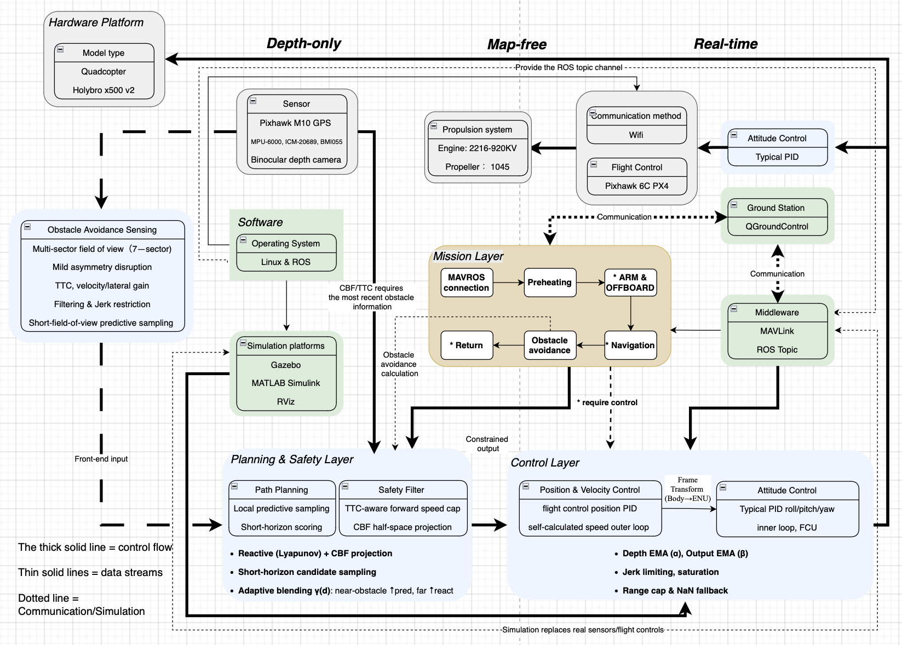
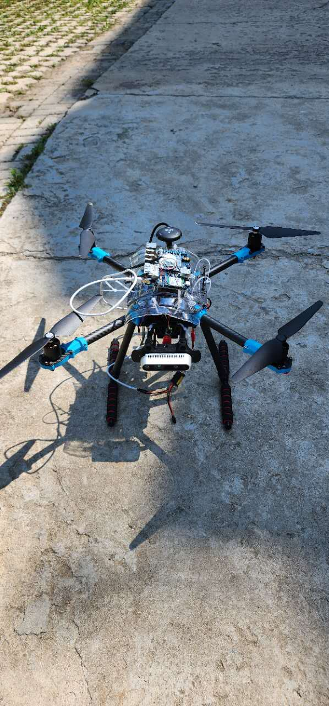

# Vision-based-Nonlinear-Control-for-UAVs
Vision-based Nonlinear UAV Control with Real-time Obstacle Avoidance using PX4, ROS, Lyapunov and Control Barrier Functions(CBF).

# Poster:



# Video:
[](https://youtu.be/Q4WJSX4zhF4)

# System Architecture:

This project has implemented an unmanned aerial vehicle (UAV) Control and obstacle avoidance system based on PX4 + ROS, integrating nonlinear Lyapunov control and Control Barrier Function (CBF), and supporting a smooth migration from simulation to the actual aircraft. The system operates in map-free, depth-only and real-time scenarios, and has robustness and real-time performance.

The system as a whole is divided into five major parts: perception layer → planning and safety layer → control layer → task layer → flight control/ground station. 
The data and control flow between the modules are as follows:
1. Hardware and sensor input

Sensors (GPS, IMU, binocular cameras) collect environmental and flight status information.
Data is input into the perception layer through ROS Topic.

2. Obstacle Avoidance Sensing

Perform multi-sector division and TTC (Time-to-Collision) calculation on the input depth map;
Perform filtering, jerk restriction and predictive sampling;
Output the status information of obstacles as the constraint conditions for the planning and safety layers.

3. Planning & Safety Layer

Path planning: Generate candidate trajectories by using local predictive sampling and short-time domain scoring;
Safety filtering: Combining CBF projection and TTC constraints to screen feasible trajectories;
Output restricted control instructions and pass them to the control layer.

4. Control Layer

Position and speed control: Outer loop PID + self-calculated speed control;
Attitude control: Inner loop PID (roll/pitch/yaw) maintains flight stability;
Provide limiting, filtering, and jerk restriction mechanisms to ensure the safety and executability of instructions;
Output control instructions to directly drive the flight control (Pixhawk PX4).

5. Mission Layer

Communicate with MAVROS and ground stations (QGroundControl);
Responsible for task-level logic (takeoff, landing, return, navigation, real-time obstacle avoidance);
Integrate the planning results with the flight control status to form a mission control closed loop.

Summary of the relationships between modules

Perception Layer → Planning and Safety Layer: Transmit obstacle information and predict environmental data;
Planning and Security Layer → Control Layer: Output control instructions under security constraints;
Control Layer → Task Layer: Provides posture/position feedback and supports logical execution of tasks;
Mission Layer ↔ Flight Control & Ground Station: Two-way communication ensures real-time mission execution and manual intervention.

# Installation
The following is a step-by-step guide for installing and building all prerequisites for running obstacle avoidance modules on Ubuntu 20.04 + ROS Noetic (including Gazebo 11) +PX4 SITL and drones based on further reducing flight weight through structural optimization of Holybro X500 V2. If a part of your system has already been installed, you can skip the corresponding steps.

Note: The following description assumes
Your catkin workspace is at ~/catkin_ws
The PX4-Autopilot directory is at ~/Home
You can also make adjustments according to the actual situation.

### 1. Install MAVROS

#### Step 1: Install ROS Noetic

First, make sure you have installed ROS Noetic, since MAVROS is built on top of ROS. Here are the steps to install ROS Noetic:

Update your system:

```Python
sudo apt update
sudo apt upgrade
```


Set up ROS sources:

```Python
sudo sh -c 'echo "deb http://packages.ros.org/ros/ubuntu $(lsb_release -cs) main" > /etc/apt/sources.list.d/ros-latest.list'
```


Add ROS public key:

```Python
sudo apt install curl
curl -sSL http://get.ros.org | sudo bash
```


Install ROS Noetic:

```Python
sudo apt update
sudo apt install ros-noetic-desktop-full
```


Initialize rosdep:

```Python
sudo rosdep init
rosdep update
```


Configure ROS environment variables:

```Python
echo "source /opt/ros/noetic/setup.bash" >> ~/.bashrc
source ~/.bashrc
```


---

#### Step 2: Install MAVROS

Install MAVROS and MAVROS extras:

```Python
sudo apt install ros-noetic-mavros ros-noetic-mavros-extras
```


Install GeographicLib tools:

```Python
sudo apt install geographiclib-tools
```


Install MAVROS configuration data:

```Python
geographiclib-get-geoids egm96-5
```


After installation, verify MAVROS is properly installed:

```Python
roscd mavros
```


---

#### Step 3: Verify MAVROS is Working

Launch MAVROS node:

```Python
roslaunch mavros px4.launch
```


Check if PX4 is successfully connected:

```Python
rostopic echo /mavros/state
```

### Step 4: Install PX4

Install from Source (Recommended for Developers)

```Python
sudo apt update
sudo apt install git python3-pip python3-venv
git clone https://github.com/PX4/PX4-Autopilot.git --recursive
cd PX4-Autopilot
bash Tools/setup/ubuntu.sh
```


Then you can run the SITL simulation:

```Python
make px4_sitl gazebo
```


### Install QGroundControl (QGC)

```Python
wget https://d176tv9ibo4jno.cloudfront.net/latest/QGroundControl.AppImage
chmod +x QGroundControl.AppImage
./QGroundControl.AppImage
```


#### Connect Pixhawk to PC

- Use a **USB-C cable** to connect Pixhawk 6C to your computer.

- Open QGroundControl, and if you see **“Vehicle connected”** at the bottom left corner, the connection is successful.

####  Flash PX4 Firmware

- Click the **⚙️ gear icon** in the top-left → **Firmware**

- Select:

  - **PX4 Flight Stack**

  - Target board: **Pixhawk 6C**

- Click **Update** or **Refresh Firmware**

---

### Step 5: Complete Sensor Calibration (**Required!**)

Click the left menu `Sensors` and complete the following calibrations:

|Calibration Item|Instructions|
|-|-|
|**Compass**|Rotate the flight controller in all directions as prompted (magnetometer).|
|**Gyroscope**|Keep the controller still for a few seconds.|
|**Accelerometer**|Place the controller flat, then flip it in six directions as prompted.|
|**Level Horizon**|Place the controller flat and click calibrate horizon.|
|✅ Airspeed (optional)|Can be skipped if no airspeed sensor is installed.|
|✅ Magnetometer Orientation (usually auto)|Automatically set, adjust manually only if incorrect.|

---

### Step 6: Configure Flight Modes

Click the left menu `Flight Modes` and set up as follows:

|Flight Mode|Recommended Setting|
|-|-|
|Mode 1|**Stabilized** (for testing)|
|Mode 2|**Position** (when GPS is available)|
|Mode 3|**Offboard** (for Python control later)|
|Others|Can remain **Unassigned**|

---

### Step 7: Preconfigure MAVLink and Python Control Interface

#### Install MAVLink and DroneKit Environment (recommended on Ubuntu)

```Python
# Install pip and Python tools
sudo apt update
sudo apt install python3-pip python3-venv

# Create a virtual environment (optional)
python3 -m venv dronekit_env
source dronekit_env/bin/activate

# Install DroneKit and pymavlink
pip install dronekit pymavlink
```
## Run the Avoidance Gazebo Simulation

### 1. Launch PX4 SITL with Gazebo

Start a simulated UAV (Iris quadrotor with depth camera) in Gazebo.

```Python
export GAZEBO_MODEL_DATABASE_URI=""
export LIBGL_ALWAYS_SOFTWARE=0        

roslaunch /home/fengyuanliu/PX4-Autopilot/launch/posix_sitl.launch \
  world:=/home/fengyuanliu/PX4-Autopilot/Tools/simulation/gazebo-classic/sitl_gazebo-classic/worlds/empty.world \
  vehicle:=iris_depth_camera \
  sdf:=/home/fengyuanliu/PX4-Autopilot/Tools/simulation/gazebo-classic/sitl_gazebo-classic/models/iris_depth_camera/iris_depth_camera.sdf \
  respawn_gazebo:=false
```


👉 **Purpose:** Start the PX4 SITL simulator with a depth-camera equipped UAV in an empty world.

---

### 2. Launch MAVROS and Connect to PX4

Set up ROS environment and bridge MAVLink between PX4 and ROS.

```Python
source /opt/ros/noetic/setup.bash
export ROS_PACKAGE_PATH=$ROS_PACKAGE_PATH:$HOME/PX4-Autopilot

rospack find px4
roslaunch mavros px4.launch fcu_url:=udp://:14540@127.0.0.1:14557 gcs_url:=
```


👉 **Purpose:** Connect PX4 SITL to ROS via MAVROS, so that higher-level modules (e.g., planners, controllers) can communicate with the flight controller.

---

### 3. Run the Vision-based Lyapunov Avoidance Module

Finally, launch the custom avoidance module.

```Python
source ~/catkin_ws/devel/setup.bash
roslaunch vision_lyapunov_avoidance min_avoid.launch
```


👉**Purpose:** Start the **vision-based nonlinear Lyapunov + Control Barrier Function (CBF) avoidance module** for real-time UAV obstacle avoidance.

### Hardware Overview

- **Frame**: Holybro X500 V2
- **Flight Controller**: Pixhawk 6C (PX4 firmware)
- **Sensors**: GPS, IMU, depth camera
- **Companion Computer**: NVIDIA Jetson (for vision & planning)
- **Propulsion**: 2216-920KV motors + 1045 propellers

Figure: Front view of the UAV platform showing Pixhawk, Companion Computer,  and depth camera



